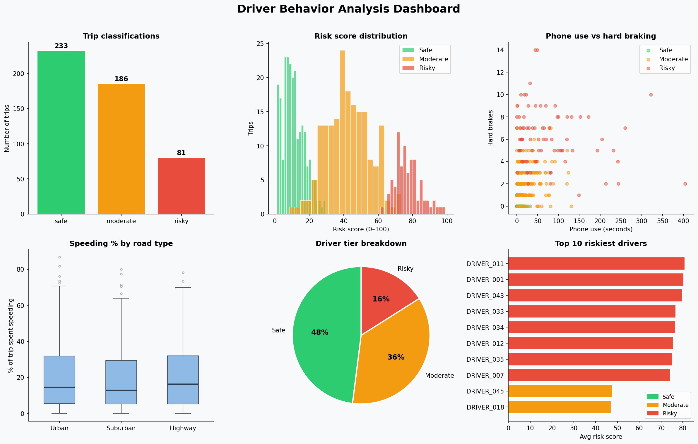

# Driver Behavior Analyzer

A end-to-end telematics pipeline that classifies driving trips as **Safe**, 
**Moderate**, or **Risky** using simulated sensor data — inspired by CMT's 
DriveWell® platform.

## What it does

- Generates realistic synthetic trip data (speed, braking, acceleration, 
  phone use, cornering) across 50 drivers and 500 trips
- Engineers behavioral features like events-per-km and phone-use-per-minute
  to normalize raw sensor readings
- Computes a human-readable **composite risk score (0–100)** per trip —
  the same approach telematics platforms use to explain risk to drivers
  and insurers
- Benchmarks **three classifiers** — Random Forest, LightGBM, and a 
  Stacking Ensemble — and automatically selects the best by cross-validated F1
- Produces a **6-panel analysis dashboard** and an **interactive map** of 
  trip risk by location

## Dashboard

## Results

| Model | Test Accuracy | CV F1 | CV Std |
|---|---|---|---|
| Random Forest | 0.9760 | **0.9838** | 0.0053 |
| LightGBM | 0.9840 | 0.9758 | 0.0054 |
| Stacking Ensemble | 0.9840 | 0.9785 | 0.0066 |

**Winner: Random Forest** — highest cross-validated F1, meaning it was most 
consistent across folds, not just on a single test split. This distinction 
matters in production where you want stable performance across unseen data,
not just one lucky split.

## Top features by importance (LightGBM)

| Feature | Importance | What it means |
|---|---|---|
| `smooth_score` | ████████████ Highest | How jerk-free the driving was overall |
| `max_speed_kmh` | █████████ | Peak speed reached during the trip |
| `speeding_pct` | ████████ | % of trip spent above the speed limit |
| `events_per_km` | █████ | Hard events normalized by distance |
| `phone_use_sec` | █████ | Total seconds of phone distraction |

Speed-related features dominate — meaning speed behavior is the strongest 
predictor of risk, more so than braking or phone use alone.

## Key findings

- **Speeding is road-type agnostic** — Urban, Suburban, and Highway drivers 
  speed at similar rates, which means road type alone isn't a reliable 
  risk signal
- **Phone use and hard braking correlate** — risky drivers cluster in the 
  top-right of the scatter plot (high phone use + high hard brakes), 
  confirming both behaviors tend to occur together
- **Driver tier split: 48% Safe, 36% Moderate, 16% Risky** — roughly 
  matching the generation priors, validating the pipeline end-to-end
- **98% classification accuracy** on synthetic data — on real messy 
  telematics data, expect 70–85%, which is the realistic production range

## Project structure
driver-behavior-analyzer/
├── generate_data.py   # Generates synthetic trip sensor dataset
├── analyzer.py        # Feature engineering + model benchmarking + scoring
├── visualize.py       # 6-panel dashboard + interactive folium map
├── data/              # Created at runtime
│   ├── trips.csv
│   ├── trips_scored.csv
│   └── driver_summary.csv
├── output/            # Created at runtime
│   ├── dashboard.png
│   └── risk_map.html
└── README.md